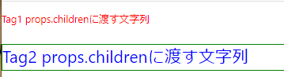

# styled-componentsの不思議な仕組み(タグ名＋文字列)を簡単なサンプルで再現

* styled-componentの「タグ名`` ` ``cssのスタイル定義`` ` ``」という書き方が気になって仕方がないため調べてみました。変数？の後ろに括弧もなく突然`` ` ``テンプレート文字文字列`` ` ``が現れるやつです。

```typescript
const TestDiv = styled.div`
  color:blue;
  font-size:20pt;
`;`
```


これは[タグ付きテンプレート](https://developer.mozilla.org/ja/docs/Web/JavaScript/Reference/Template_literals#tagged_templates)という構文で、関数に文字列を渡すのとほぼ同じ事ができるようです。詳細はリンク先でご確認ください。

```javascript
function tag(strings) {
  console.log(strings.raw[0]);
}
tag`string text line 1 \n string text line 2`;
// tag('文字列');
```

## styled-componentsの仕組みを再現する最小限のサンプルコード

こんな感じで使える「なんちゃってstyled-componsnts」を作ってみます。

```typescript
// 「なんちゃってstyled-componsnts」を関数として呼び出して、コンポーネントを取得
const Tag1 = pTag('color:red;');

// 「なんちゃってstyled-componsnts」をタグ付きテンプレートとして呼び出す
const Tag2 = pTag`
color:blue;
font-size:20pt;
`;

// Tag2はborderをprops経由で渡す
return (
  <div className="App">
    <Tag1>Tag1</Tag1>
    <Tag2 style={{border:'1px solid green'}}>Tag2</Tag2>
  </div>
);
```


* ソース全体

  * 仕組み自体は難しくありません。&lt;style&gt;タグと&lt;p&gt;タグをセットで作成し、ユニークなclass名をつけて、styleの適用をしています

```tsx
let seq = 0; // classNameを重複させないためのシーケンス番号

// 「<p>タグ＋スタイル設定」コンポーネントを返す「なんちゃってstyled-componsnts」
const pTag = (styles: ReadonlyArray<string> | string) => {
  return (props: any) => {
    // class名を生成(重複しないようにseqをカウントアップ)
    const clsNm = `clsNm${seq++}`;

    // <style>タグを<p>をセットで生成する
    // 重複しないclass名でタグとセレクタを作成する
    // propsはpタグに引き渡す
    return (
      <>
        <style>.{clsNm} {'{'}{styles}{'}'}</style>
        <p className={`${clsNm}`} {...props}>{props.children}</p>
      </>    
    )
  }
};

// 「なんちゃってstyled-componsnts」を関数として呼び出して、コンポーネントを取得
const Tag1 = pTag('color:red;');

// 「なんちゃってstyled-componsnts」をタグ付きテンプレートとして呼び出す
const Tag2 = pTag`
color:blue;
font-size:20pt;
`;

// 生成したコンポーネントを表示する
function App() {
  return (
    <div className="App">
      <Tag1>Tag1 props.childrenに渡す文字列</Tag1>
      <Tag2 style={{border:'1px solid green'}}>Tag2 props.childrenに渡す文字列</Tag2>
    </div>
  );
}

export default App;

```


* 生成した画面イメージ

指定したスタイルが適用されていることがわかります。

  


* 生成したDOM

  
## 参考ページ

[Demystifying styled-components](https://www.joshwcomeau.com/react/demystifying-styled-components/)
